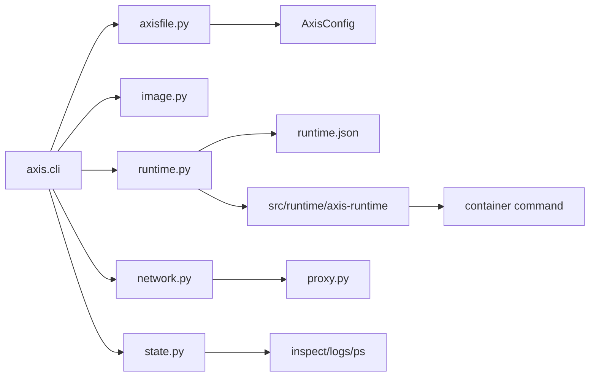

# Architecture

Axis is an educational container runtime with a Python orchestration layer and a small C++ runtime binary. Python owns the user-facing CLI, `Axisfile` parsing, Docker image extraction, persisted state, networking, logs, inspect output, and restart supervision. C++ owns Linux namespace, mount, cgroup, `chroot`, and `execvp` operations.

## System Shape

- **Type**: local CLI runtime, not a daemon.
- **Primary user**: a developer learning how container runtimes work.
- **Primary contract**: `Axisfile` plus CLI commands.
- **Runtime state**: local files under `.axis/`.
- **Execution model**: `axis run` stays attached to the runtime process and streams output.

## Component Map



## Core Boundaries

- `src/axis/` is the Python control plane. It is allowed to call Docker, `ip`, `iptables`, `nsenter`, and the C++ runtime executable.
- `src/runtime/` is the Linux runtime. It should stay focused on syscalls and process setup, not CLI behavior.
- `.axis/` is generated state. It is not source code and should not be committed.
- `docs/` documents behavior and design decisions. It should be updated when runtime flows or user-facing syntax change.

## Python To C++ Boundary

Python does not use Cython, `ctypes`, or a native extension. It writes a JSON config and launches the C++ program with `subprocess.Popen`.

```text
Python AxisConfig -> .axis/containers/<id>/runtime.json
Python subprocess -> src/runtime/axis-runtime runtime.json
C++ stdout -> AXIS_PID <pid> and process logs
Python -> network, logs, inspect, status, restart loop
```

The runtime JSON currently includes `name`, `rootfs`, `hostname`, `workdir`, `command`, `env`, `ports`, `bind_mounts`, `restart`, `cgroup_path`, `memory`, and `cpu`. C++ consumes the process setup fields and bind mounts. Python owns ports and restart policy.

## Runtime Responsibilities

Python:

- Parse and validate `Axisfile`.
- Pull/export Docker images into rootfs directories.
- Copy local files into the rootfs.
- Persist lifecycle state, resource ownership, logs, runtime config, and network metadata.
- Start and monitor `src/runtime/axis-runtime`.
- Configure bridge networking and localhost port proxies.
- Capture logs and answer `ps`, `inspect`, `logs`, `stats`, `reconcile`, `stop`, and `clean`.
- Implement foreground `RESTART always`.

C++:

- Parse runtime JSON.
- `clone()` the container process with PID, mount, UTS, and network namespaces.
- Run a tiny PID 1 init path that forks the configured app, forwards signals, and reaps child processes.
- Set hostname.
- Make mount propagation private.
- Apply bind mounts before `chroot`.
- Enter rootfs with `chroot`.
- Mount `/proc`.
- Apply environment and `execvp()` the configured command.
- Apply cgroup v2 memory and CPU limits from the parent process.

## Reliability Model

Axis is still a local CLI runtime, but it now has several production-hardening primitives:

- Lifecycle state is persisted with state, desired state, timestamps, exit details, restart count, and manual stop intent.
- State writes are atomic, and per-container locks protect lifecycle and resource journal writes.
- `.axis/containers/<id>/resources.json` records owned resources such as rootfs, cgroups, veths, IPs, proxies, and bind mounts.
- `axis stats` reads cgroup v2 resource counters.
- `axis reconcile` repairs simple stale metadata such as dead running PIDs and stale proxy PID entries.
- Network IP allocation is protected by a file lock, and IPs are released during network cleanup.
- The Python localhost proxy handles concurrent client connections.

`RESTART always` is foreground supervision only. If the attached `axis run` command exits, restart supervision stops.

Axis still has no daemon. Full recovery after CLI exit or host reboot is limited to explicit `axis reconcile`; a future `axisd` should own long-lived supervision, event history, and serialized command handling.

## Failure Injection

The runtime supports failpoints for testing partial setup and cleanup behavior:

- `after-rootfs-create`
- `before-runtime-start`
- `after-runtime-start`
- `after-network-setup`
- `after-proxy-start`
- `after-veth-create`
- `after-iptables`
- `after-cgroup-create`

Use them with `AXIS_FAILPOINT=<name>` during tests.

## Security Boundary

`axis run` requires root because it creates namespaces, veth pairs, routes, cgroups, bind mounts, and iptables rules. The code should treat `Axisfile` paths as untrusted input:

- `COPY` destinations must remain inside the rootfs.
- `VOLUME` container destinations must be absolute, not `/`, and must not escape through `..`.
- Host volume sources must already be directories.

## References

- Module map: `Modules.md`
- Runtime flows: `Codepath.md`
- Operational workflows: `Workflow.md`
- Low-level implementation: `LLD.md`
- Decisions: `Decisions.md`
