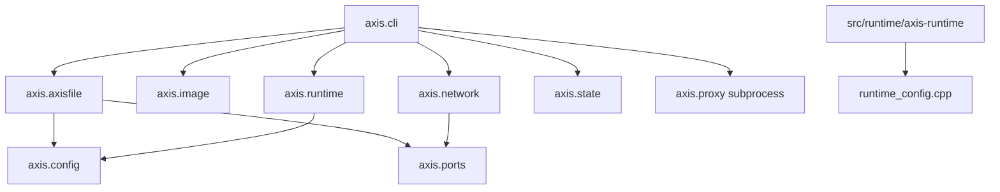

# Dependencies

## Internal Dependencies

Allowed dependency direction:

- CLI may depend on any Python helper module.
- Parser may depend on config and small validators only.
- Runtime Python may write config but should not configure networking.
- C++ runtime should not call back into Python.
- `state.py` should stay filesystem-focused and not call Docker or network commands.

## External Runtime Dependencies

### Python 3.11+

- **Used by**: all Python CLI modules and tests.
- **Criticality**: high.
- **Failure impact**: CLI cannot run.

### Docker CLI

- **Used by**: `axis.image.prepare_rootfs`.
- **Commands**: `docker pull`, `docker create`, `docker export`, `docker rm`.
- **Criticality**: high for `axis run`.
- **Failure impact**: rootfs cannot be prepared.

### GNU/Linux Namespace And Cgroup APIs

- **Used by**: `src/runtime/Container.cpp`.
- **Calls/files**: `clone`, `sethostname`, `mount`, `chroot`, `execvp`, `/sys/fs/cgroup`.
- **Criticality**: high.
- **Failure impact**: container cannot start or limits are not applied.

### Network Tools

- **Used by**: `axis.network`.
- **Commands**: `ip`, `nsenter`, `sysctl`, `iptables`, `iptables-save`.
- **Criticality**: high for networked containers.
- **Failure impact**: container may start but networking or port publishing fails.

### C++ Compiler

- **Used by**: `make build`.
- **Default**: `g++`.
- **Flags**: `-std=c++17 -Wall -Wextra -Wpedantic -O2`.
- **Criticality**: high before running containers.

### tar

- **Used by**: `axis.image`.
- **Criticality**: high for Docker image export.

## Python Standard Library Dependencies

Axis uses only the Python standard library at runtime:

- `argparse`, `json`, `os`, `pathlib`, `signal`, `subprocess`, `sys`, `time`.
- `dataclasses`, `shutil`, `uuid`.
- `ipaddress`, `socket`, `selectors`, `shlex`.
- `unittest`, `tempfile` in tests.

## Contract Dependencies

### `Axisfile`

The user-facing config contract. Changes should be backward compatible unless deliberately changing the language.

### `runtime.json`

The Python-to-C++ contract. Any C++-consumed field must be written by Python and parsed in `runtime_config.cpp`.

### `.axis/containers/<id>/`

The CLI command state contract. `ps`, `stop`, `inspect`, `logs`, and `clean` rely on these files.

## Change Impact Checklist

Before changing:

1. `Axisfile` syntax: update parser tests, `SPECS.md`, `Examples.md`, and `LLD.md`.
2. Runtime JSON: update `src/axis/runtime.py`, `src/runtime/runtime_config.*`, and runtime config tests.
3. Container state files: update `state.py`, `Workflow.md`, `Codepath.md`, and tests.
4. Network setup: update root-required integration notes and `Architecture.md`.
5. CLI commands: update `README.md`, `Examples.md`, and `Workflow.md`.
